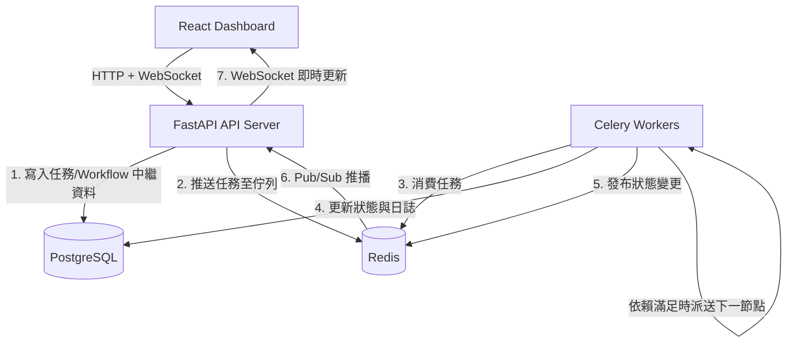

# ⚡ Coworkify - Distributed Task Scheduling & Execution Platform

[](https://fastapi.tiangolo.com)
[](https://www.postgresql.org/)
[](https://redis.io/)
[](https://www.python.org/)
[](https://react.dev/)
[](https://www.docker.com/)

**Coworkify** 是一個輕量、高效且具備彈性的分散式任務排程與管理平台（架構靈感源自 Apache Airflow 與 Celery）。使用者與微服務可以透過 RESTful API 定義、排程、追蹤與監控各類非同步任務，並支援多任務串接成 DAG workflow。

---

## 🌟 核心特色 (Key Features)

- 🔄 **完整的任務生命週期管理**：支援 `pending` ➔ `running` ➔ `success` / `failed` / `retrying` / `cancelled` 狀態機流轉。
- ⚡ **高性能非同步架構**：以 FastAPI 作為核心 API 閘道，結合 Redis 實現低延遲訊息佇列 (Message Broker)。
- 🎯 **任務優先級調度 (Priority Queue)**：支援任務加權插隊，優先處理高優先級核心任務。
- ⏱️ **排程與延遲執行**：支援立即執行、指定時間執行與定時排程。
- 🛡️ **彈性重試機制**：內建自訂重試次數 (`max_retries`) 與指數退避策略 (Exponential Backoff)。
- 🔗 **DAG Workflow 編排**：支援多個任務依照依賴關係串接執行（`task1 → task2 → task3`，含分支/合併），單一節點失敗會自動連鎖取消下游節點。
- 🚦 **Redis 滑動窗口限流**：每個 API Key／IP 獨立計算請求速率，防止單一來源打爆系統。
- ⚡ **即時任務狀態推播**：透過 WebSocket 與 Redis Pub/Sub 實現任務狀態即時推播，前端無需輪詢。
- 🔒 **API 金鑰認證**：支援 X-API-Key Header 進行 API 存取認證。
- 📊 **即時 Ops 儀表板**：React 前端提供任務佇列深度、吞吐量、錯誤率的即時可視化。

---

## 🏗️ 系統架構 (System Architecture)



## 📦 內建支援的任務類型 (Supported Task Handlers)

| 任務類型 (task_type) | 說明 |
| :--- | :--- |
| `echo` | 簡單回聲任務，用於測試系統連通性 |
| `heavy_computation` | 模擬耗時運算任務，可指定執行時間 |
| `flaky_task` | 模擬可能失敗的任務，用於測試自動重試機制 |

---

## 🚀 快速開始 (Quick Start)

### 配置需求
- Docker / Docker Compose

### 1. 設定環境變數
複製一份 `.env`（範例參考 `docker-compose.yml` 所需的變數：`POSTGRES_USER`、`POSTGRES_PASSWORD`、`POSTGRES_DB`、`API_KEYS` 等），改成自己的值。

### 2. 一鍵啟動全部服務
```bash
docker-compose up -d --build
```
會啟動：PostgreSQL、Redis、FastAPI API、Celery Worker、React 前端。

- 🌐 前端 Dashboard: http://localhost:5173
- 📖 API 文件 (Swagger UI): http://localhost:8000/docs
- ❤️ 健康檢查: http://localhost:8000/health

### 3. 啟動 Locust 壓力測試
```bash
locust -f tests/locustfile.py --host http://localhost:8000
```

---

## 主要 API 端點

### Tasks
| Method | Endpoint | 說明 |
| :--- | :--- | :--- |
| `POST` | `/tasks/` | 建立並自動派發任務 (支援立即或指定 `scheduled_at` 排程) |
| `GET` | `/tasks/` | 分頁查詢任務列表 (支援狀態/類型篩選與優先級排序) |
| `GET` | `/tasks/{task_id}` | 查詢單一任務詳細狀態與回傳結果 |
| `DELETE` | `/tasks/{task_id}` | 刪除指定任務 |

### Workflows (DAG)
| Method | Endpoint | 說明 |
| :--- | :--- | :--- |
| `POST` | `/workflows/` | 建立一組 DAG workflow，自動派送沒有依賴的根節點任務 |
| `GET` | `/workflows/{workflow_id}` | 查詢 workflow 整體狀態與每個節點對應任務的即時狀態 |

一個 3 節點線性 workflow 範例：
```json
POST /workflows/
{
  "name": "demo-pipeline",
  "steps": [
    { "key": "t1", "name": "step1", "task_type": "echo", "payload": {"message": "step1"}, "depends_on": [] },
    { "key": "t2", "name": "step2", "task_type": "echo", "payload": {"message": "step2"}, "depends_on": ["t1"] },
    { "key": "t3", "name": "step3", "task_type": "echo", "payload": {"message": "step3"}, "depends_on": ["t2"] }
  ]
}
```
`depends_on` 可以填多個 key，支援分支與合併（真正的 DAG，不只是線性鏈）；任一節點徹底失敗（重試耗盡）時，所有下游節點會被自動標記為 `cancelled`，整個 workflow 標記為 `failed`。

### 其他
| Method | Endpoint | 說明 |
| :--- | :--- | :--- |
| `GET` | `/health` | API 伺服器健康檢查 |
| `WS` | `/ws/tasks` | WebSocket 即時任務狀態推播 (Redis Pub/Sub) |

所有 `/tasks` 與 `/workflows` 端點都需要帶 `X-API-Key` header，並受 Redis 滑動窗口限流保護。

---

## 📊 壓力測試報告 (Benchmark Results)

> ⚠️ 以下數字待重測——上次測試是在修正 API 限流器的 event-loop 阻塞問題之前跑的，實際吞吐量應該會更好。重新用 `locust -f tests/locustfile.py` 跑一輪後更新這張表。

使用 **Locust** 進行高併發負載測試，模擬多用戶並發讀寫請求（包含資料庫查詢、任務建立與 Redis 佇列派發）：
- **總測試請求數**：35,987 Requests
- **失敗率**：**0.0% (0 Failures)**
- **系統吞吐量 (Throughput)**：**288.15 RPS**
- **平均延遲 (Average Latency)**：**38.9 ms**
- **P95 延遲**：**100 ms**
- **中位數延遲 (Median)**：**24 ms**

| API 端點 | 請求類型 | 平均延遲 (ms) | 吞吐量 (RPS) | 失敗率 |
| :--- | :--- | :--- | :--- | :--- |
| `GET /health` | 健康檢查 | 9.3 ms | 48.8 RPS | 0% |
| `GET /tasks` | 資料庫分頁查詢 | 26.5 ms | 145.0 RPS | 0% |
| `POST /tasks` | 任務建立 + 佇列派發 | 73.4 ms | 94.3 RPS | 0% |

---

## 前端開發

React + TypeScript + Tailwind SPA，細節見 [frontend/README.md](frontend/README.md)。`docker-compose up` 起來後 Vite dev server 會自動 proxy `/api` 跟 `/ws` 到後端，不需要另外設 CORS。
