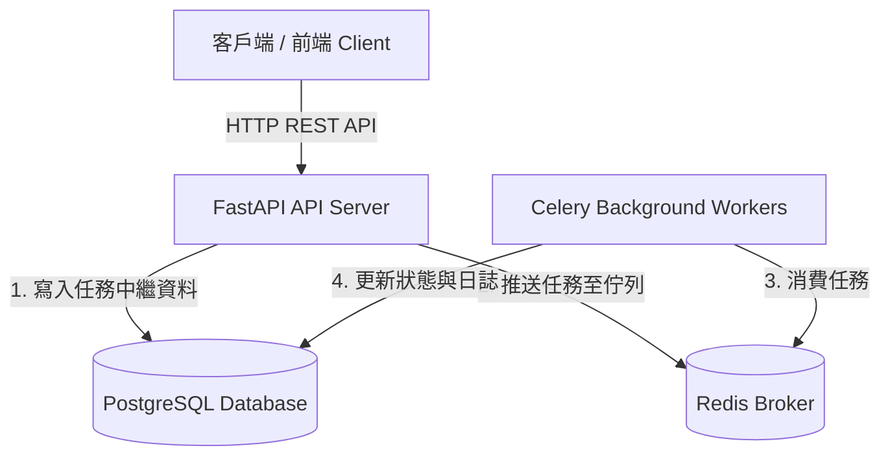

# ⚡ Coworkify - Distributed Task Scheduling & Execution Platform

[](https://fastapi.tiangolo.com)
[](https://www.postgresql.org/)
[](https://redis.io/)
[](https://www.python.org/)
[](https://www.docker.com/)

**Coworkify** 是一個輕量、高效且具備彈性的分散式任務排程與管理平台（架構靈感源自 Apache Airflow 與 Celery）。使用者與微服務可以透過 RESTful API 定義、排程、追蹤與監控各類非同步任務。

---

## 🌟 核心特色 (Key Features)

- 🔄 **完整的任務生命週期管理**：支援 `pending` ➔ `running` ➔ `success` / `failed` / `retrying` / `cancelled` 狀態機流轉。
- ⚡ **高性能非同步架構**：以 FastAPI 作為核心 API 閘道，結合 Redis 實現低延遲訊息佇列 (Message Broker)。
- 🎯 **任務優先級調度 (Priority Queue)**：支援任務加權插隊，優先處理高優先級核心任務。
- ⏱️ **排程與延遲執行**：支援立即執行、指定時間執行與定時排程。
- 🛡️ **彈性重試機制**：內建自訂重試次數 (`max_retries`) 與退避策略 (Backoff Strategy)。
- 📊 **端到端可觀測性**：紀錄任務執行耗時、錯誤堆疊 (Traceback) 與工作節點狀態。

---

## 🏗️ 系統架構 (System Architecture)



## 使用方式 

## 配置需求
- Python 3.11 or above
- Docker

### 啟動服務
```bash
docker-compose up -d
```

### 啟動 FastAPI
```bash
pip install -r requirements.txt
uvicorn app.main:app --reload
```

### 啟動 Celery Worker
```bash
uvicorn app.worker:celery --loglevel=info
```