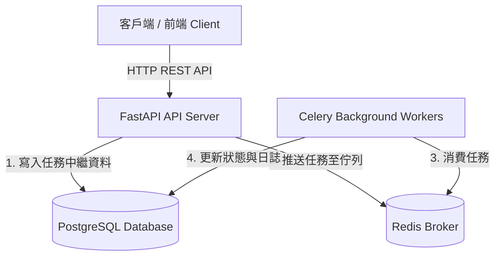

# ⚡ Coworkify - Distributed Task Scheduling & Execution Platform

[](https://fastapi.tiangolo.com)
[](https://www.postgresql.org/)
[](https://redis.io/)
[](https://www.python.org/)
[](https://www.docker.com/)

**Coworkify** 是一個輕量、高效且具備彈性的分散式任務排程與管理平台（架構靈感源自 Apache Airflow 與 Celery）。使用者與微服務可以透過 RESTful API 定義、排程、追蹤與監控各類非同步任務。

---

## 🌟 核心特色 (Key Features)

- 🔄 **完整的任務生命週期管理**：支援 `pending` ➔ `running` ➔ `success` / `failed` / `retrying` / `cancelled` 狀態機流轉。
- ⚡ **高性能非同步架構**：以 FastAPI 作為核心 API 閘道，結合 Redis 實現低延遲訊息佇列 (Message Broker)。
- 🎯 **任務優先級調度 (Priority Queue)**：支援任務加權插隊，優先處理高優先級核心任務。
- ⏱️ **排程與延遲執行**：支援立即執行、指定時間執行與定時排程。
- 🛡️ **彈性重試機制**：內建自訂重試次數 (`max_retries`) 與退避策略 (Backoff Strategy)。
- 📊 **端到端可觀測性**：紀錄任務執行耗時、錯誤堆疊 (Traceback) 與工作節點狀態。
- ⚡ **即時任務狀態推播**：透過 WebSocket 與 Redis Pub/Sub 實現任務狀態即時推播。
- 🔒 **API 金鑰認證**：支援 X-API-Key Header 進行 API 存取認證。
---

## 🏗️ 系統架構 (System Architecture)



## 📦 內建支援的任務類型 (Supported Task Handlers)

| 任務類型 (task_type) | 說明 |
| :--- | :--- |
| `echo` | 簡單回聲任務，用於測試系統連通性 |
| `heavy_computation` | 模擬耗時運算任務，可指定執行時間 |
| `flaky_task` | 模擬可能失敗的任務，用於測試自動重試機制 |

## 使用方式 

### 配置需求
- Python 3.11 or above
- Docker

### 啟動服務
```bash
docker-compose up -d
```

### 啟動 FastAPI
```bash
pip install -r requirements.txt
uvicorn app.main:app --reload
```

### 啟動 Celery Worker
```bash
# 一般啟動 (Windows 環境加上 --pool=solo)
celery -A app.celery_app.celery_app worker --loglevel=info --pool=solo

# 或使用 watchfiles 啟動 (支援程式碼存檔自動熱重載)
watchfiles "celery -A app.celery_app.celery_app worker --loglevel=info --pool=solo" app
```

## 📖 互動式 API 文件 (Swagger UI)
啟動後可開啟瀏覽器存取 Swagger UI 進行線上 API 測試：

- 🌐 **API 文件**: [http://127.0.0.1:8000/docs](http://127.0.0.1:8000/docs)

### 主要 API 端點
| Method | Endpoint | 說明 |
| :--- | :--- | :--- |
| `POST` | `/tasks/` | 建立並自動派發任務 (支援立即或指定 `scheduled_at` 排程) |
| `GET` | `/tasks/` | 分頁查詢任務列表 (支援狀態/類型篩選與優先級排序) |
| `GET` | `/tasks/{task_id}` | 查詢單一任務詳細狀態與回傳結果 |
| `GET` | `/tasks/{task_id}/logs` | 查詢特定任務的歷史執行與重試日誌 |
| `DELETE` | `/tasks/{task_id}` | 刪除指定任務 |
| `GET` | `/health` | API 伺服器健康檢查 |
| `WS` | `/ws/tasks` | WebSocket 即時任務狀態推播 (Redis Pub/Sub) |
---

## 📊 壓力測試報告 (Benchmark Results)
使用 **Locust** 進行高併發負載測試，模擬多用戶並發讀寫請求（包含資料庫查詢、任務建立與 Redis 佇列派發）：
- **總測試請求數**：35,987 Requests
- **失敗率**：**0.0% (0 Failures)**
- **系統吞吐量 (Throughput)**：**288.15 RPS**
- **平均延遲 (Average Latency)**：**38.9 ms**
- **P95 延遲**：**100 ms**
- **中位數延遲 (Median)**：**24 ms**

| API 端點 | 請求類型 | 平均延遲 (ms) | 吞吐量 (RPS) | 失敗率 |
| :--- | :--- | :--- | :--- | :--- |
| `GET /health` | 健康檢查 | 9.3 ms | 48.8 RPS | 0% |
| `GET /tasks` | 資料庫分頁查詢 | 26.5 ms | 145.0 RPS | 0% |
| `POST /tasks` | 任務建立 + 佇列派發 | 73.4 ms | 94.3 RPS | 0% |