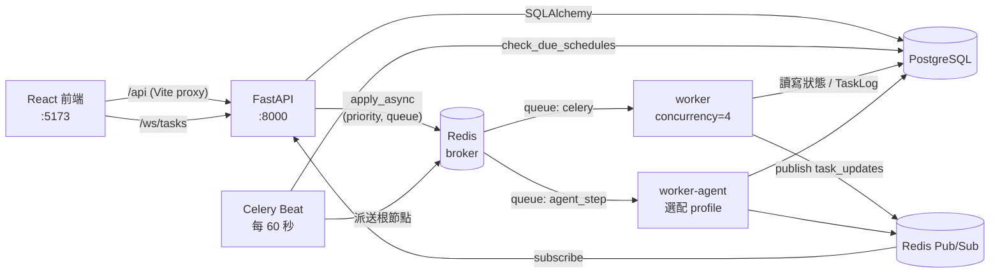

# Coworkify 新人導覽

> 寫給剛加入專案的你。讀完這份文件，你應該能說清楚 Coworkify 在做什麼、一個 workflow 從建立到跑完經過哪些程式碼、在哪裡改東西，以及哪些地方容易踩雷。
>
> 這份文件講的是「專案怎麼運作、怎麼開發」。產品怎麼使用請看站內的 **Getting started** 頁（`/getting-started`），API 清單與壓測數據請看 [README](../README.md)。三份文件盡量不重複，有衝突時以程式碼為準，並請順手修正文件。

---

## 0. 第一週建議節奏

| 時間 | 目標 | 完成標準 |
| :--- | :--- | :--- |
| 第 1 天 | 把整套服務跑起來，當一次使用者 | 註冊帳號、照 Getting started 建出一條 workflow 並跑成功、設一個排程 |
| 第 2 天 | 讀懂資料模型與名詞 | 能解釋 definition / run / step / task 的差別（見第 2 節） |
| 第 3 天 | 追一次完整的執行路徑 | 從 `POST /definitions/{id}/runs` 一路追到 `advance_workflow` 派出下游（見第 4 節） |
| 第 4 天 | 跑測試、讀測試 | 本機 `pytest` 全綠，讀完 `tests/test_executor_workflow.py` |
| 第 5 天 | 第一個小改動 | 例如新增一種 task type 的欄位、修一個文件落差，開 PR 走完 CI |

卡住超過半小時就來問，不要自己硬撐。

---

## 1. Coworkify 是什麼

一句話：**一個輕量版的 Airflow + Celery**——讓使用者用 API 或視覺化畫布定義「多個步驟串成的 DAG」，由背景 worker 分散執行，並提供重試、分支、展開/收斂（for_each / reduce）、cron 排程與即時狀態推播。

技術棧：

| 層 | 技術 | 位置 |
| :--- | :--- | :--- |
| API | FastAPI（同步 `def` 端點 + SQLAlchemy 2.0） | `app/api/` |
| 資料庫 | PostgreSQL 15 | `app/models/`、`app/db.py` |
| 佇列 / 結果 / Pub/Sub / 限流 | Redis 7 | `app/celery_app.py`、`app/core/rate_limit.py`、`app/api/ws.py` |
| 背景執行 | Celery worker + Celery Beat | `app/tasks/` |
| 前端 | React 19 + TypeScript + Tailwind + React Flow（`@xyflow/react`）+ TanStack Query | `frontend/` |
| 選配 AI 步驟 | [Codoctopus](https://github.com/ccoliu/Codoctopus)（`agent_step`） | `Dockerfile.agent` |

---

## 2. 心智模型：先把名詞弄清楚

這是新人最容易混淆的地方，請務必先讀懂。

```
WorkflowDefinition（產線，可重複使用，有版本號）
   │  每次執行（帶自己的 input）
   ▼
Workflow（一次 run）── steps_template：建立當下的 steps 快照
   │
   ├── WorkflowStep ──1:1── Task ──1:N── TaskLog（每次嘗試一筆）
   ├── WorkflowStep ──1:1── Task
   └── WorkflowStepTemplate（for_each 尚未展開的模板，展開後變成真正的 Step + Task）

WorkflowSchedule ──► 指向 WorkflowDefinition（+ 自己的 input），由 Beat 每 60 秒檢查
```

| 名詞 | 資料表 | 說明 |
| :--- | :--- | :--- |
| **Definition**（定義／產線） | `workflow_definitions` | `steps` + `input_schema` + `version`。本身不執行。`steps` 或 `input_schema` 改動時版本號 +1 |
| **Run / Workflow**（一次執行） | `workflows` | 程式碼裡叫 `Workflow`，UI 上叫 run。保存 `steps_template` 快照、`definition_version`、`input`、最終 `result`。狀態只有 `pending` / `success` / `failed` |
| **Step** | `workflow_steps` | run 裡的一個節點，記錄 DAG 關係：`depends_on`（**存的是 task id，不是 step key**）、`step_key`、`branch_of_key` / `branch_when`、`reduce_of_key` |
| **Task** | `tasks` | 真正被 Celery 執行的單位，有 `task_type`、`payload`、`priority`、重試次數。也可以不屬於任何 workflow，直接用 `POST /tasks/` 建立 |
| **TaskLog** | `task_logs` | 每次執行嘗試一筆（成功、重試中、最終失敗），`GET /tasks/{id}/logs` 讀的就是它。**下游取上游結果也是從這裡查** |
| **StepTemplate** | `workflow_step_templates` | `for_each` 步驟在來源還沒跑完前，不知道要展開成幾份，所以先存模板 |
| **Schedule** | `workflow_schedules` | cron + `definition_id` + `input`。舊資料可能沒有 `definition_id` 而是自帶 `steps` 快照 |

Task 狀態機：

```
pending ──► running ──► success
               │
               ├──► retrying ──(2^n 秒後)──► running ...
               │
               └──► failed（重試耗盡）──► 下游全部 cancelled，workflow = failed

condition 分支沒命中的那一邊 ──► cancelled（預期行為，workflow 仍可能 success）
```

兩個關鍵設計決定：

1. **定義與執行分離**：run 保留建立當下的快照，所以改定義不會改寫歷史；但排程存的是 `definition_id`，所以改定義後**下一次排程觸發就用新版**。
2. **`cancelled` 不等於失敗**：分支沒命中的 `cancelled` 是正常結果。workflow 判定成功的條件是「所有 task 都是 `success` 或 `cancelled`」。

---

## 3. 系統架構



`docker-compose.yml` 起的服務：`postgres`、`redis`、`api`、`worker`、`beat`、`frontend`；`worker-agent` 只在 `--profile agent` 時啟動。所有 Python 服務都把專案目錄掛進容器（`.:/app`），API 開了 `--reload`，**改 Python 程式碼 API 會自動重載，但 worker 和 beat 要手動 restart 才會吃到新程式碼**（`docker compose restart worker beat`）。

---

## 4. 一次執行的完整路徑（最重要的一節）

建議打開編輯器，跟著這一節逐個檔案看。

### 4.1 建立 run

1. 前端 Run 表單 → `POST /definitions/{id}/runs`（`app/api/definitions.py` 的 `run_definition`）
2. 依定義的 `input_schema` 驗證、補預設值（`app/schemas/definition.py` 的 `resolve_run_input`）
3. 呼叫 **`create_workflow_from_steps`**（`app/tasks/executor.py`）——API、rerun、排程三條路都共用這個函式：
   - 建 `Workflow`，存 `steps_template` 快照
   - `_inject_run_input`：把這次的 input 塞進 `input` 步驟的 `payload.data`
   - 一般步驟 → 建 `Task` + `WorkflowStep`，`depends_on` 的 step key 在這裡**換成 task id**
   - `for_each` 步驟 → 只建 `WorkflowStepTemplate`
   - 沒有依賴、也不是 reduce 的步驟就是根節點，直接 `dispatch_task`

### 4.2 派送與執行

- `dispatch_task` → `execute_task.apply_async(priority=..., queue=queue_for_task_type(...))`。`agent_step` 走專屬 queue（`DEDICATED_QUEUES` in `app/celery_app.py`），其餘走 `celery`。
- Worker 端的 **`execute_task`**（Celery task 名稱 `coworkify.execute_task`）：
  1. 檢查 task 是否被軟刪除、是否已經是終態（冪等保護）
  2. 標成 `running`，透過 Redis Pub/Sub 推播
  3. 從 `TASK_REGISTRY`（`app/tasks/handler.py`）找 handler，執行 `handler(task.payload)`
  4. 成功 → `record_task_success`；例外 → `record_task_failure`（還有次數就 `retrying` 並 `self.retry(countdown=2**n)`，否則 `failed`）

### 4.3 推進 workflow：`advance_workflow`

每個 task 成功或最終失敗後都會呼叫它，**這是整個系統的心臟**，所有 DAG 語意都在這裡：

成功時：
1. `expand_dynamic_steps`：如果這個 task 是某個 `for_each` 的來源，依它的結果（必須是 list）展開成 N 組 Task + Step；接在後面的 `reduce_of` 步驟的 `depends_on` 也在此時被填上
2. 如果它是 `condition`，把 `branch_when` 不符的那一邊連同下游標成 `cancelled`
3. 掃所有依賴它、且依賴已全部 `success` 的下游，派送前依序處理 payload：
   - reduce 步驟：`render_reduce_payloads` 代入 `{{items}}`
   - 有 `{{steps.<key>.result...}}` 的：`render_step_refs` 字串代換
   - `python` / `shell`：`collect_upstream_inputs` 把**所有祖先**的結果放進 `payload.inputs`
   - `condition` 沒填 `left`：`resolve_condition_left` 自動帶入唯一上游的結果
4. 全部 `success`/`cancelled` → workflow 標 `success`，`_collect_workflow_output` 把終端節點結果寫進 `workflows.result`

失敗時：`_cascade_cancel` 取消所有下游（含還沒展開的孤兒 reduce），workflow 標 `failed`。

### 4.4 重跑與續跑

| 操作 | 端點 | 行為 |
| :--- | :--- | :--- |
| Re-run | `POST /workflows/{id}/rerun` | 用同一份快照與 input **建一個新 run** |
| Retry | `POST /workflows/{id}/retry` | `retry_workflow_from_failure`：**同一個 run** 上，把失敗 task 和「被它連坐取消的下游」重設為 pending；分支沒命中的 `cancelled` 維持不動 |

Retry 怎麼區分兩種 `cancelled`？它重新走一次失敗 task 的下游閉包——閉包內的是被連坐的，閉包外的是分支落選的。函式上方的 docstring 寫得很清楚，請細讀。

### 4.5 排程

`beat` 每 60 秒觸發 `coworkify.check_due_schedules`（`app/tasks/scheduler.py`），找出 `enabled` 且 `next_run_at <= now` 的排程，依**定義當下的內容**呼叫 `create_workflow_from_steps`，再用 `app/core/cron.py` 算下一次時間。單一排程失敗只會跳過該排程，時間照樣往前推。

### 4.6 即時推播

Worker 的 `notify_status_change` → Redis channel `task_updates` → `app/api/ws.py` 訂閱後轉發給 `/ws/tasks` 的每個 WebSocket 連線 → 前端 `frontend/src/context/WsContext.tsx` 收到事件後讓相關的 TanStack Query 快取失效重抓，列表與畫布節點因此即時更新。

---

## 5. 目錄導覽

```
app/
├── main.py              FastAPI 進入點，註冊 router；啟動時 create_all 建表
├── db.py                engine（pool 50+50）、SessionLocal、get_db
├── celery_app.py        Celery 設定、優先級、queue 定義、beat 排程
├── api/                 HTTP / WS 端點（薄薄一層，商業邏輯盡量放 tasks/executor）
│   ├── auth.py          註冊、登入、/me
│   ├── tasks.py         單一任務 CRUD、/tasks/types（回傳 catalog）、/logs
│   ├── definitions.py   產線 CRUD、/runs
│   ├── workflows.py     run 查詢、rerun、retry、promote-to-schedule、舊的 POST /workflows/
│   ├── schedule.py      排程 CRUD
│   └── ws.py            /ws/tasks
├── core/
│   ├── security.py      bcrypt、JWT（HS256，7 天）、get_current_user
│   ├── rate_limit.py    Redis sorted set 滑動窗口
│   └── cron.py          croniter + Asia/Taipei 時區
├── models/              SQLAlchemy model（見第 2 節）
├── schemas/             Pydantic；workflow.py 的 StepsGraph.validate_dag 是 DAG 規則的唯一真相
└── tasks/
    ├── executor.py      ★ 執行引擎：execute_task、advance_workflow、展開/收斂/分支/續跑
    ├── handler.py       各 task_type 的實作 + TASK_REGISTRY
    ├── catalog.py       各 task_type 的欄位規格（驅動前端表單）
    ├── sandbox.py       python/shell 的受限 subprocess
    └── scheduler.py     Beat 的排程檢查

frontend/src/
├── pages/               路由頁面（App.tsx 定義路由）
├── features/workflows/  畫布編輯器：graphModel.ts（畫布 ⇄ steps 轉換）、validateGraph.ts（前端版 DAG 驗證）
├── features/tasks|ops|schedules/
├── context/             Auth（JWT 存 localStorage）、WebSocket、Toast、Theme
├── lib/apiClient.ts     所有 API 呼叫；types.ts 是前後端共用的型別（手動同步）
└── components/          共用 UI 元件

tests/                   pytest；locustfile.py 是壓測
scripts/migrations/      手寫 SQL migration（見第 7 節）
.archify/                自動產生的架構圖（HTML），可以用瀏覽器打開看
```

---

## 6. 開發環境

### 6.1 啟動

```bash
# 根目錄沒有 .env 範例檔，請自己建立 .env，至少要有以下變數：
# POSTGRES_USER / POSTGRES_PASSWORD / POSTGRES_DB
# DATABASE_URL=postgresql://<user>:<pw>@localhost:5432/<db>   ← 給本機跑 pytest 用
# JWT_SECRET=$(python -c "import secrets; print(secrets.token_hex(32))")
# 選填：DISCORD_WEBHOOK_URL、CODOCTOPUS_PATH、AGENT_STEP_DEFAULT_MODEL、ANTHROPIC_API_KEY

docker compose up -d --build
```

- 前端：http://localhost:5173
- Swagger：http://localhost:8000/docs（右上角 Authorize 貼 JWT 就能直接打 API）
- 健康檢查：http://localhost:8000/health

### 6.2 常用指令

```bash
docker compose logs -f worker          # 看任務執行的 log，除錯第一站
docker compose restart worker beat     # 改了 app/tasks/ 之後一定要做
docker compose exec postgres psql -U $POSTGRES_USER $POSTGRES_DB
docker compose --profile agent up -d   # 需要 agent_step 時

# 測試（在主機上跑，不是容器裡）
pip install -r requirements-dev.txt
python -m pytest tests -q -rs          # -rs 可看到 DB 測試被 skip 的原因

# 前端
cd frontend && npm ci && npm run lint && npm run build
```

### 6.3 測試策略

| 檔案 | 測什麼 | 需要外部服務？ |
| :--- | :--- | :--- |
| `test_workflow_templating.py` | `validate_dag` 規則、各種 `render_*` 代換 | 否 |
| `test_task_routing.py` | `task_type` → queue 路由 | 否 |
| `test_handler_agent_step.py` | `agent_step` handler（mock 掉 Codoctopus） | 否，但要能 import codoctopus |
| `test_executor_workflow.py` | 整條 workflow 的派送、for_each/reduce、分支、失敗、續跑 | **要 Postgres**（自動建 `<DB>_test`），Celery 派送被換成記錄器 |

`tests/conftest.py` 的 `db` fixture 每個測試後會 TRUNCATE 全部表。執行引擎相關的改動，**請一定要在 `test_executor_workflow.py` 補案例**——那是我們對 DAG 語意唯一的自動化保護。

### 6.4 CI

`.github/workflows/ci.yml` 在 push 到 `main` 和每個 PR 跑：

- **Backend tests**：Python 3.11 / 3.12 矩陣，帶 Postgres service，額外 checkout Codoctopus 安裝，跑 pytest + coverage
- **Frontend**：`npm ci` → `npm run lint`（oxlint）→ `npm run build`（含 `tsc` 型別檢查）

PR 送出前請本機先跑過這兩組。

---

## 7. 常見開發任務怎麼做

### 7.1 新增一種 task type（最常見）

前端是由 catalog 驅動的，所以**通常不用改前端**：

1. `app/tasks/handler.py`：寫 `handle_xxx(payload) -> 結果`，丟例外就代表失敗（會自動重試）；註冊進 `TASK_REGISTRY`
2. `app/tasks/catalog.py`：在 `TASK_TYPE_CATALOG` 加一筆，描述欄位（`kind` 可用 `string` / `text` / `code` / `select` 等，參考既有項目）。**不加進 catalog 的話前端選單看不到**（舊的 demo handler 就是刻意這樣藏起來的）
3. 若需要特殊依賴或資源，考慮像 `agent_step` 一樣在 `DEDICATED_QUEUES` 開專屬 queue
4. 若有 DAG 層面的特殊規則（像 `condition`、`input`），同時改 `app/schemas/workflow.py` 的 `validate_dag` **和** `frontend/src/features/workflows/validateGraph.ts`
5. 補測試；更新 README 的任務類型表格
6. `docker compose restart worker`

### 7.2 改資料庫結構

我們**沒有用 Alembic**。`main.py` 啟動時的 `Base.metadata.create_all` 只會建「不存在的表」，**不會幫既有的表加欄位**。所以：

1. 改 `app/models/` 的 model
2. 在 `scripts/migrations/` 新增 `YYYY_MM_DD_<描述>.sql`，用 `BEGIN; ... COMMIT;` 包起來，盡量寫成可重複執行（`IF NOT EXISTS`）
3. 本機套用：`docker compose exec -T postgres psql -U $POSTGRES_USER $POSTGRES_DB < scripts/migrations/xxx.sql`
4. 測試庫不用處理，fixture 每次都從 model 重建

### 7.3 改 DAG 驗證規則

規則有**兩份**：後端 `StepsGraph.validate_dag`（最終把關）與前端 `validateGraph.ts`（即時提示）。兩邊必須同步，PR 裡只改一邊會被要求補上。

### 7.4 新增 API 端點

照既有 router 的寫法：router 層級掛 `Depends(get_current_user)` 與 `RateLimiter`，request/response 用 `app/schemas/` 的 Pydantic model，前端在 `lib/apiClient.ts` 加方法、`lib/types.ts` 加型別。

---

## 8. 踩雷清單與已知技術債

請在動到相關程式碼前先看過這份清單。標 ⚠️ 的是真的有人踩過的。

**執行引擎**
- ⚠️ `WorkflowStep.depends_on` 存的是 **task id 字串**，不是 step key；step key 只在建立時用。
- ⚠️ `python` 步驟的結果被包成 `{stdout, value, ...}`，真正的回傳值在 `value`。從 TaskLog 取值時要經過 `_unwrap_result`，否則 python 接 for_each 會靜悄悄地展開成 0 項。
- step key 只能用 `[a-zA-Z0-9_]`，模板 regex 寫死。
- `{{steps...}}` 是字串插值，會失去型別；`python` / `shell` 請用 `inputs` / `./get_input`。
- 不支援巢狀 for_each；branch 步驟不能同時是 for_each / reduce。
- `agent_step` 若沒有 `worker-agent` 在跑，會**永遠停在 pending**，不會報錯。

**安全**
- `python` / `shell` 的 sandbox（`app/tasks/sandbox.py`）只有 timeout、rlimit、清空環境變數，**仍與 worker 共用檔案系統與網路，不是真正的隔離**。不要讓不受信任的人寫程式碼步驟。
- `/ws/tasks` 目前**沒有驗證身份**，任何人連上都能收到所有任務的狀態事件。
- 資料**沒有多租戶隔離**：登入後看得到所有人的 task / definition / schedule（`created_by` 有存但沒拿來過濾）。
- `JWT_SECRET` 沒設時會 fallback 成 `changeme_jwt_secret`，部署前務必設定。
- CORS 目前是 `allow_origins=["*"]`。
- `http_request` / `fetch_page` 有 SSRF 檢查（擋內網與 metadata endpoint），新增會發網路請求的 handler 請沿用 `_validate_public_url`。

**時間與排程**
- DB 的 `DateTime` 欄位是 naive UTC（`datetime.utcnow()`），cron 以 `Asia/Taipei` 解讀；`app/core/cron.py` 負責轉換，自己算時間時要注意。
- 排程最小粒度是 Beat 的 60 秒檢查週期。

**效能**
- API 端點是同步 `def` + 同步 SQLAlchemy，高併發下會在 thread pool 排隊（見 README 壓測說明），async 化是已知的改進方向。
- `RateLimiter(times=5000, seconds=1)` 實際上幾乎不會擋人，壓測時調高的，正式上線前要重新評估。
- 預設 worker 只有 `concurrency=4`，workflow 與一般 task 共用。

**文件落差（歡迎當作第一個 PR）**
- 根目錄沒有 `.env.example`，新人只能從 `docker-compose.yml` 反推需要哪些變數。
- `frontend/README.md` 還寫著用 API key 登入、`/tasks/{id}/logs` 未實作，兩者都已過時。
- `notify`（Discord）task type 已在 catalog 中，但 README 的任務類型表格沒列。
- `app/tasks/scheduler.py` 的註解寫「每 5 秒」，實際 Beat 週期是 60 秒。

---

## 9. 協作慣例

- **分支 / PR**：不要直接推 `main`，開分支送 PR，CI 綠燈才合併。
- **Commit message**：Conventional Commits，例如 `feat(workflows): ...`、`fix(executor): ...`、`test(executor): ...`、`docs: ...`。
- **程式碼註解**：專案以繁體中文註解為主，重點寫「為什麼」而不是「做了什麼」——`executor.py` 裡的註解是好範例。
- **文件**：行為有變就同步更新 README（中英兩份：`README.md`、`README.en.md`）與站內 Getting started（`frontend/src/pages/GettingStarted.tsx`）。
- **前後端型別**：`frontend/src/lib/types.ts` 是手動對應 `app/schemas/` 的，改 schema 時記得一起改。

---

## 10. 建議閱讀順序

1. [README](../README.md) 的「核心特色」與「主要 API 端點」
2. 站內 `/getting-started`，實際操作一遍
3. `app/models/workflow.py` → `app/schemas/workflow.py`（`validate_dag`）
4. `app/tasks/executor.py`：`create_workflow_from_steps` → `execute_task` → `advance_workflow` → `expand_dynamic_steps` → `retry_workflow_from_failure`
5. `tests/test_executor_workflow.py`（把它當成規格書讀）
6. `app/tasks/handler.py` + `catalog.py` + `sandbox.py`
7. `frontend/src/features/workflows/graphModel.ts` 與 `validateGraph.ts`
8. `.archify/coworkify-architecture.html`（用瀏覽器開，整體架構圖）

## 11. 自我檢核

讀完後試著回答，答不出來就回去對應章節：

1. 改了一條 definition 的 steps，已經跑過的 run 會怎樣？綁著它的排程下次觸發會怎樣？
2. 一個 condition 的 false 分支被 `cancelled`，為什麼 workflow 還是 `success`？
3. 某步驟重試耗盡失敗後按 Retry，哪些 task 會被重設？哪些不會？
4. 為什麼 python 步驟不建議用 `{{steps.x.result}}` 取上游資料？
5. 新增一個 model 欄位，為什麼重啟 API 之後欄位還是不存在？
6. 改了 `handler.py` 但行為沒變，第一個該檢查什麼？

歡迎加入，有任何讓這份文件更好的建議，直接開 PR 改它。
